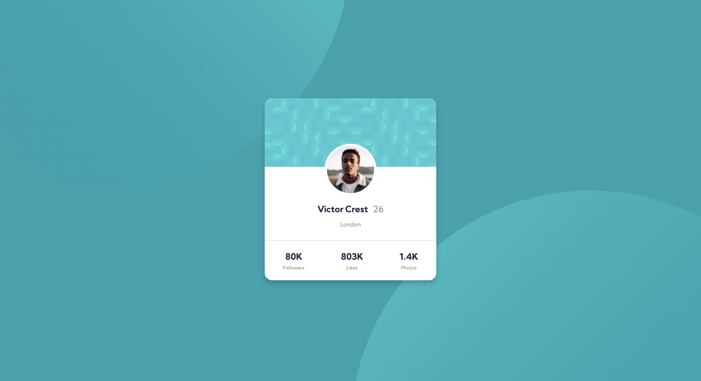

# Frontend Mentor - Profile card component solution

This is my solution to the [Profile card component challenge on Frontend Mentor](https://www.frontendmentor.io/challenges/profile-card-component-cfArpWshJ). Please feel free to give me feedback!

### Screenshot

   
   

### Links

- Solution URL: [https://www.frontendmentor.io/solutions/profile-card-component-solution-EGxJlvhlr](https://www.frontendmentor.io/solutions/profile-card-component-solution-EGxJlvhlr)
- Live Site URL: [https://ellieroy.github.io/profile-card/](https://ellieroy.github.io/profile-card/)

### Built with

- HTML
- CSS custom properties
- Flexbox

## Author

- Frontend Mentor - [@ellieroy](https://www.frontendmentor.io/profile/ellieroy)

## Acknowledgments

I used the [solution](https://www.frontendmentor.io/solutions/profile-card-component-5WYuqW2jg) written by Hugo Alberto as a reference. 
